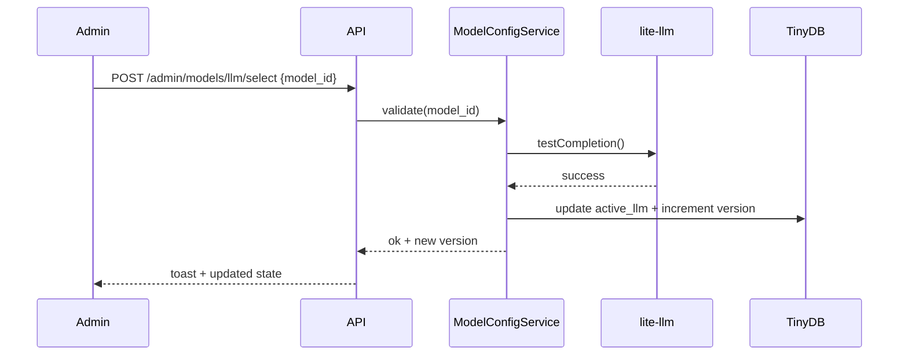
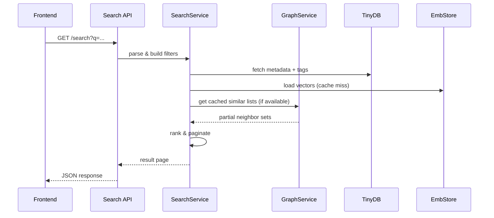

<!-- Fullstack Architecture Document -->
# Fullstack Architecture: Research Catalog Database (v0.1)
Status: Draft (Proceeding with default assumptions)  
Date: 2025-09-22  
Defaults Confirmed: UMAP enabled | 3072-dim embeddings | Soft budget alerts | Single-process async runtime | Enrichment concurrency=5

## 1. Context & Goals
Deliver an MVP platform for continuous ingestion, enrichment, clustering, theory exploration, and interactive cluster visualization with dynamic model configuration (LLM + embeddings) via `lite-llm`, while remaining lightweight (TinyDB + flat files) and evolvable toward ANN indices and richer graphs.

Key Non-Goals (MVP): user auth, citation graph, ANN index, persistent job orchestrator, multi-node scaling.

## 2. High-Level System Overview
Primary logical subsystems:
1. API Layer (FastAPI Routers)
2. Ingestion Orchestrator (arXiv + GitHub fetch loops)
3. Enrichment Pipeline (LLM summarization + scoring + embeddings)
4. Graph & Similarity Layer (edges + ranking + cluster membership)
5. Clustering & Projection Jobs (HDBSCAN/k-means + UMAP → coordinates)
6. Theory Analysis (classification support/contradict + suggestions)
7. ModelConfigService (lite-llm model switching + validation)
8. Storage Layer (TinyDB collections + embeddings directory + PDFs + repo snapshots)
9. Admin Operations (projection rebuild, model switch, ingestion control)

### 2.1 Mermaid System Context
```mermaid
flowchart LR
  User[User / Browser] -->|HTTP| API[FastAPI Layer]
  API --> SearchService
  API --> TheoryService
  API --> ModelConfigService
  API --> AdminOps[Admin Operations]
  subgraph AsyncRuntimes[Async Background]
    Ingest[Ingestion Loops]
    Enrich[Enrichment Workers (5)]
    ClusterJob[Clustering & Projection Job]
  end
  Ingest --> Queue[In-Memory Task Queue]
  Queue --> Enrich
  Enrich --> GraphService
  Enrich --> TinyDB[(TinyDB Collections)]
  Enrich --> EmbStore[(Embeddings Store)]
  GraphService --> TinyDB
  ClusterJob --> GraphService
  ClusterJob --> TinyDB
  ModelConfigService --> TinyDB
  API --> TinyDB
  API --> EmbStore
  API --> GraphService
```

### 2.2 ASCII System Context
```
  +----------------------+         +------------------+
  |      Browser /      |  HTTP   |     FastAPI      |
  |  React Frontend     +-------->+  Routers (API)   |
  +----------+----------+         +----+--+----+-----+
             |                       |  |  |   |
             |                       |  |  |   +--> Admin Ops
             |                       |  |  +------> ModelConfigService
             |                       |  +---------> TheoryService
             |                       +------------> SearchService
             |                               |
             |                               v
             |                         +-------------+
             |                         | GraphService|
             |                               |
             |          +---------------------+---------------------+
             |          | Background Async Runtimes                 |
             |          |  +----------+    +---------+    +-------+ |
             |          |  | Ingest   | -> | Queue   | -> |Enrich | |
             |          |  +----------+    +---------+    +---+---+ |
             |          |                                 |   |     |
             |          |                     +-----------+   |     |
             |          |                     | Clustering &  |     |
             |          |                     | Projection    |     |
             |          +---------------------+-----------+---+-----+
             |                                         v   v
             |                                   +-----------+   +--------------+
             +---------------------------------->|  TinyDB   |   | Embeddings   |
                                                 | (Collections)| | (Vectors)    |
                                                 +-----------+   +--------------+
```

## 3. Runtime Topology
Single OS process, event loop (uvicorn) hosts:
- HTTP server
- Periodic tasks (async loops with `asyncio.create_task`)
- Task queue (simple asyncio Queue) feeding enrichment workers

Scaling Path: Add separate worker process later; or migrate ingestion/enrichment into a small Celery/RQ cluster; maintain interfaces to facilitate extraction.

## 4. Module Breakdown
| Module | Responsibility | Key Interfaces |
|--------|----------------|----------------|
| api.routes.search | /search, /item | SearchService, TinyDB, GraphService |
| api.routes.theory | /theory/query, /theory/save | TheoryService, TinyDB |
| api.routes.admin | ingestion controls, cluster rebuild, model endpoints | IngestionController, ClusterManager, ModelConfigService |
| ingestion.arxiv_fetcher | Poll arXiv | returns RawPaperMetadata |
| ingestion.github_fetcher | Repo discovery | returns RawRepoMetadata |
| ingestion.scheduler | Interval loops & enqueue | pushes tasks to queue |
| enrichment.pipeline | Orchestrates classification & scoring | uses LiteLLMClient, EmbeddingClient |
| enrichment.prompts | Prompt templates and examples | consumed by pipeline |
| graph.similarity | Cosine + Jaccard + composite rank | uses embeddings & tags |
| graph.edges | Maintains edge JSON | read/write adjacency |
| clustering.job | Batch clustering + projection | HDBSCAN/UMAP or fallback |
| projection.store | Persist coords + version | stored in TinyDB item doc |
| theory.classifier | support vs contradict classification | LLM few-shot prompt |
| model_config.service | Model listing + validation + switching | lite-llm API / test ping |
| storage.repository | Thin wrapper around TinyDB collections | CRUD primitives |
| metrics.telemetry | Counters, timers, cost estimation | logs + optional Prom stub |

## 5. Data Storage Design
### 5.1 TinyDB Collections
- papers
- repos
- theories
- edges (structured list or per-edge-type bucket; alternative: JSON file + cached index)
- clusters (cluster metadata: id, size, label (optional), projection_version)
- config (active models, versions, thresholds, flags)
- audit (model switches, manual reprocess events)

### 5.2 Entity Document Shape (Paper)
```json
{
  "_id": "p_abc123",
  "type": "paper",
  "title": "...",
  "abstract": "...",
  "authors": ["..."],
  "published_at": "2025-09-01",
  "categories": ["cs.AI"],
  "summary": "...",
  "findings": ["..."],
  "questions": ["..."],
  "tags": ["rl"],
  "scores": {"relevance": 8, "interesting": 9, "rationale": {"relevance": "...", "interesting": "..."}},
  "embedding_ref": "emb/p_abc123.npy",
  "cluster_id": 5,
  "projection": {"x": 0.412, "y": -0.221, "version": 3},
  "enrichment_version": 1,
  "llm_model_version": 5,
  "embedding_model_version": 2,
  "ingested_at": "2025-09-21T12:30:00Z"
}
```

### 5.3 Edge Representation
Edges stored as adjacency lists per item or central `edges` collection with entries:
```json
{"from": "p_abc123", "to": "p_def456", "type": "SIMILAR", "weight": 0.83, "batch": 3}
```
Index caches built at startup: `similar_index[from] -> list[(to, weight)]`.

### 5.4 Embedding Store
Directory: `embeddings/` containing `.npy` arrays.  
Hash-based naming for idempotency: `{item_id}_{embedding_model_version}.npy`.  
Potential future: memory-mapped array for bulk similarity (ANN upgrade path).

### 5.5 Config & Versioning
`config` document example:
```json
{
  "active_llm": {"id": "gpt-4.1-mini", "version": 6},
  "active_embedding": {"id": "text-embedding-3-large", "dimension": 3072, "version": 2},
  "reindex_required": false,
  "cost_alert_threshold": 0.35
}
```

## 6. Versioning & Compatibility Strategy
Fields per item: `enrichment_version`, `llm_model_version`, `embedding_model_version` ensure traceability of differences across model changes.
Embedding Model Switch (dimension mismatch): set `reindex_required=true`; existing similarity graph read-only; new items tagged with new model version but flagged as EXCLUDED from similarity until reindex run.

## 7. Clustering & Projection Pipeline
1. Snapshot embeddings for all items of current embedding_model_version.
2. Dimensionality reduction for clustering (option: PCA whitening first).
3. Clustering: HDBSCAN (if dataset > 1K) else k-means adaptive k.
4. UMAP on full or sample (≥ 10K items use sampling + interpolation) else PCA fallback.
5. Assign cluster labels + coordinates.
6. Persist cluster metadata & coordinates; increment `projection_version`.
7. Broadcast projection_version via config update (used by frontend invalidation).

### 7.1 Mermaid Clustering Flow
```mermaid
flowchart TD
  Start[Trigger (interval or admin)] --> Collect[Collect Embeddings]
  Collect --> DimReduce[PCA (optional)]
  DimReduce --> Cluster{ >1000 items? }
  Cluster -->|Yes| HDBSCAN[HDBSCAN]
  Cluster -->|No| KMEANS[k-means adaptive k]
  HDBSCAN --> Projection[UMAP / PCA Fallback]
  KMEANS --> Projection
  Projection --> Persist[Persist clusters + coords]
  Persist --> UpdateConfig[Update projection_version]
  UpdateConfig --> Done[Done]
```

### 7.2 ASCII Clustering Flow
```
 Trigger --> Collect Embeddings --> (Optional PCA) --> Decide Algo
   If >1000 => HDBSCAN
   Else     => k-means
   -> UMAP (fallback PCA) -> Persist (clusters + coords) -> Update projection_version -> Done
```

## 8. Similarity & Ranking
Similarity composite: `R = 0.55*cosine + 0.20*jaccard_tags + 0.15*recency_decay + 0.10*interesting_norm`.
- Recency decay = exp(-age_days / horizon) (horizon default 90).
- Jaccard computed on normalized tag sets; consider caching tag bitmasks.
- Normalization: maintain running min/max or rolling z-score for interestingness.
Caching Layer: For each item store top-N similar with timestamp; refresh on cluster job or item update.

## 9. Theory Mode Classification
Pipeline per query:
1. Retrieve candidate items: top K (K=200 default) by embedding proximity to theory embedding.
2. Batch LLM classification prompts (group size ≤ 12 items) produce label + rationale logit delta → confidence score.
3. Partition into supports / contradicts; if (supports+contradicts) < threshold suggest related queries (embedding neighbor tags & high-MI tag combos).
4. Return trimmed evidence objects (lazy-load full details on demand).

## 10. Admin Model Configuration Flow
### 10.1 Mermaid Model Switch Flow


### 10.2 ASCII Model Switch Flow
```
Admin -> API -> ModelConfigService -> lite-llm test call
  success -> update config (increment llm_model_version) -> response -> UI toast
```

Embedding Switch adds conditional branch for dimension mismatch → requires force flag & sets `reindex_required`.

## 11. Observability & Metrics
Metrics (log first, later Prom instrumentation):
- ingestion_items_total, ingestion_failures_total
- enrichment_latency_seconds (histogram)
- tokens_consumed_total (by model_id)
- clustering_duration_seconds
- projection_version_current
- theory_query_latency_seconds
- model_switch_count{type=llm|embedding}
Log Correlation: Each pipeline run uses `trace_id` (uuid4) passed through sub-steps.

## 12. Performance Budgets
| Path | Target |
|------|--------|
| Search median | <300 ms |
| Similarity recompute batch | <5 min for 10K items |
| Clustering + projection | <8 min (10K items) |
| Enrichment p95 per item | <7 min |
| Cluster map payload | <1.5 MB (compressed) |

Optimization levers: sampling for UMAP, caching tag bitmasks, lazy findings load, deferring repo deep analysis until needed.

## 13. Security & Secrets
`.env` holds OPENAI / Azure credentials. Model changes only permitted to authenticated admin (simple shared admin token header in MVP). No user PII persisted.

## 14. Failure Modes & Recovery
| Scenario | Strategy |
|----------|----------|
| arXiv rate limit | Backoff w/ jitter; persist last cursor |
| GitHub rate limit | Respect remaining header; slowdown factor |
| LLM timeout | Retry (max 2) then mark item partial + enqueue for later retry window |
| Embedding model dimension mismatch | Set `reindex_required`, suspend similarity expansions for new-model items |
| Clustering failure | Keep last stable projection_version; log error; retry next cycle |
| UMAP import fails | Fallback to PCA projection |

## 15. Test Strategy
Layers:
- Unit: scoring formula, recency decay, tag Jaccard, model config validators.
- Integration: ingestion → enrichment → similarity pipeline with synthetic fixtures.
- Property Tests: ranking stability under rescaled scores.
- Regression Snapshots: projection_version drift detection (hash sample coordinates tolerance < epsilon).
- Load Simulation: 1K fake items to test clustering path.

## 16. Deployment & Local Dev
Use `uv` for dependency management. Docker multi-stage: build (install + compile UMAP dependencies) then slim runtime (only needed wheels, prompts, models config). Provide `docker-compose` (future) to run FastAPI + a volume for data.

## 17. Future Evolution Path
- Replace naive similarity search with ANN index (Faiss/HNSW) once >20K items.
- Introduce citation ingestion & directional edges.
- Temporal cluster evolution slider & animated transitions.
- Prompt template versioning service.
- Multi-tenant separation (namespace prefix in collections).

## 18. Open Risks & Mitigations (Delta)
| Risk | Mitigation |
|------|-----------|
| Memory pressure with large embedding arrays | Switch to memory-mapped consolidated matrix |
| UMAP reproducibility variance | Fixed random_state + ordering; persist seed in config |
| Lite-llm provider drift (model deprecations) | Model availability health cron + fallback mapping |
| Large repo clones | Shallow clone + cap file scan size |

## 19. ASCII High-Level Request Lifecycle
```
SEARCH:
Browser -> /search -> SearchRouter -> Query Parser -> Tag Filter + Cluster Filter -> Candidate IDs
 -> Load Embeddings (if needed) -> Similarity / Ranking -> Paginate -> JSON Response

THEORY:
Browser -> /theory/query -> Embed theory -> Retrieve top-K embeddings -> Batch classify (LLM)
 -> Partition evidence -> Suggest related (if sparse) -> Response

CLUSTER MAP:
Browser -> /clusters/map -> Return cached projection (version) -> Frontend renders

MODEL SWITCH:
Browser (Admin) -> /admin/models/...select -> Validate -> testCompletion -> Update config
 -> Increment version -> Response -> Frontend invalidates caches
```

## 20. Mermaid Request Lifecycle (Search)


---
End of Fullstack Architecture v0.1
